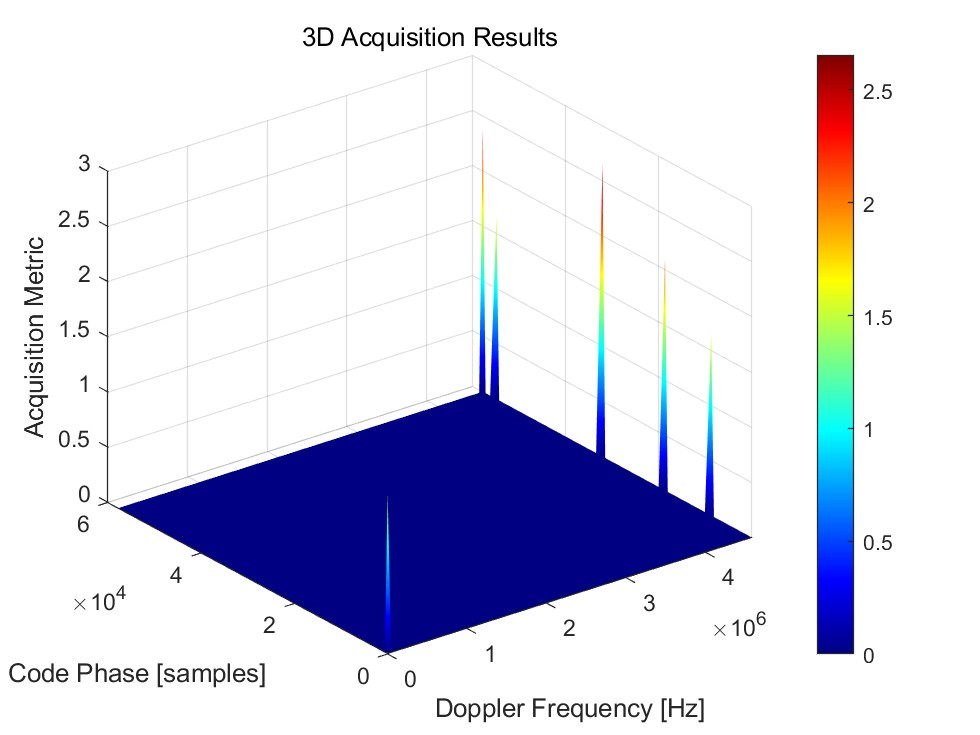

# Assignment-1-of-AAE6102_23062929r

## Task 1: Acquisition
Process the IF data using a GNSS SDR and generate the initial acquisition results.

The purpose of acquisition is to identify visible satellites and estimate the approximate values of the **carrier phase** and **code phase** of the satellite signals. 

**carrier phase**: Used for downconversion, including the Doppler effect.

**code phase**: Generates a local PRN code to align with the incoming signal.  
 
The acquisition algorithm used here is  **Parallel Code Phase search acquisition** . 

**Step 1**: Generate the carrier frequency with various Doppler shifts. The frequency step is 500 Hz, and the range is from -7 kHz to 7 kHz.
```
  frqBins(frqBinIndex) = settings.IF - settings.acqSearchBand + ...
                                             0.5e3 * (frqBinIndex - 1);
```
**Step 2**：Perform Parallel Code Phase search acquisition for a single satellite using 20 ms of data.
```
  caCodeFreqDom = conj(fft(caCodesTable(PRN, :)));
......
  IQfreqDom1 = fft(I1 + 1i*Q1);
  IQfreqDom2 = fft(I2 + 1i*Q2);
......
 convCodeIQ1 = IQfreqDom1 .* caCodeFreqDom;
 convCodeIQ2 = IQfreqDom2 .* caCodeFreqDom;
......
   acqRes1 = abs(ifft(convCodeIQ1));
   acqRes2 = abs(ifft(convCodeIQ2));
```
**Step 3**：Set the acquisition threshold and proceed to fine acquisition.
### Acquisiton result (Opensky.bin)

Five GPS satellites (PRN 16, 22, 26, 27, and 31) have been successfully acquired, with their code delay and Doppler information displayed below

| Satellite PRN | Doppler Frequency (Hz) | Code Phase |
|---------------|------------------------|------------|
| 16            | -240.4022216796875     | 31994      |
| 26            | 1916.8090820303187     | 57754      |
| 31            | 1066.3700103797019     | 18744      |
| 22            | 1571.102142330259      | 55101      |
| 27            | -3220.396041870117     | 8814       |



GPS satellites PRN 16, 22, 26, 27, and 31 have been successfully acquired! The corresponding skyplot is displayed below.


### Acquistion result (Urban.dat)

Four GPS satellites (PRN 1, 3, 11, and 18) have been successfully acquired, with their code delay and Doppler information displayed below

| Satellite PRN | Doppler Frequency (Hz) | Code Phase |
|---------------|------------------------|------------|
| 1             | -4578797.416687012     | 3329       |
| 3             | -4575710.372924805     | 25173      |
| 11            | -4579590.873718262     | 1155       |
| 18            | -4580322.341918945     | 10581      |


GPS satellites PRN 1, 3, 11, and 18 have been successfully acquired! The corresponding skyplot is displayed below.


Compared to open-sky environments, fewer GPS satellites are acquired due to the obstruction caused by buildings.In open-sky environments, GPS receivers have a clear line of sight to a larger number of satellites, which allows for more accurate and reliable positioning. However, in urban areas or environments with significant obstructions, such as tall buildings, the number of visible satellites is reduced. This phenomenon is known as urban canyon effect.

Buildings and other structures can block or reflect GPS signals, leading to a decrease in the number of satellites that the receiver can acquire. This can result in several issues:

    Reduced Accuracy: With fewer satellites, the GPS receiver has less information to calculate an accurate position. This can lead to errors in the reported location.

    Signal Multipath: Reflected signals from buildings can cause multipath errors, where the GPS receiver picks up both the direct and reflected signals, further degrading accuracy.

    Intermittent Signal Loss: In dense urban environments, the GPS receiver may frequently lose and reacquire signals, leading to intermittent positioning data.

Overall, the presence of buildings and other obstructions significantly impacts the performance of GPS receivers, making it challenging to maintain a stable and accurate position fix. This is why fewer satellites are acquired in such environments compared to open-sky conditions.

## Task 2: Tracking
### 2.1 Code Analysis
The purpose of tracking is to refine the carrier frequency and code phase values, ensuring continuous monitoring.

For code tracking, an early-late prompt discriminator with a spacing of 0.5 chips is used.

Calculate the correlator output
```
            I_E = sum(earlyCode  .* iBasebandSignal);
            Q_E = sum(earlyCode  .* qBasebandSignal);
            I_P = sum(promptCode .* iBasebandSignal);
            Q_P = sum(promptCode .* qBasebandSignal);
            I_L = sum(lateCode   .* iBasebandSignal);
            Q_L = sum(lateCode   .* qBasebandSignal);

```
Employing a Delay Lock Loop (DLL) discriminator to fine-tune the code phase.
```
 codeError = (sqrt(I_E * I_E + Q_E * Q_E) - sqrt(I_L * I_L + Q_L * Q_L)) / ...
                (sqrt(I_E * I_E + Q_E * Q_E) + sqrt(I_L * I_L + Q_L * Q_L));
```
### 2.2 Multi-correlator Gerneration

**To derive the Autocorrelation function, it is necessary to implement multiple correlators.**

In this case, **multiple correlators with a spacing of 0.1 chips, ranging from -0.5 chips to 0.5 chips, are utilized.**
```
            tcode       = (remCodePhase-0.4) : codePhaseStep : ((blksize-1)*codePhaseStep+remCodePhase-0.4);
            tcode2      = ceil(tcode) + 1;
            earlyCode04    = caCode(tcode2);
            tcode       = (remCodePhase-0.3) : codePhaseStep : ((blksize-1)*codePhaseStep+remCodePhase-0.3);
            tcode2      = ceil(tcode) + 1;
            earlyCode03    = caCode(tcode2);
            tcode       = (remCodePhase-0.2) : codePhaseStep : ((blksize-1)*codePhaseStep+remCodePhase-0.2);
            tcode2      = ceil(tcode) + 1;
            earlyCode02    = caCode(tcode2);
            tcode       = (remCodePhase-0.1) : codePhaseStep : ((blksize-1)*codePhaseStep+remCodePhase-0.1);
            tcode2      = ceil(tcode) + 1;
            earlyCode01    = caCode(tcode2);
            tcode       = (remCodePhase+0.1) : codePhaseStep : ((blksize-1)*codePhaseStep+remCodePhase+0.1);
            tcode2      = ceil(tcode) + 1;
            lateCode01    = caCode(tcode2);
            tcode       = (remCodePhase+0.2) : codePhaseStep : ((blksize-1)*codePhaseStep+remCodePhase+0.2);
            tcode2      = ceil(tcode) + 1;
            lateCode02   = caCode(tcode2);
            tcode       = (remCodePhase+0.3) : codePhaseStep : ((blksize-1)*codePhaseStep+remCodePhase+0.3);
            tcode2      = ceil(tcode) + 1;
            lateCode03    = caCode(tcode2);
            tcode       = (remCodePhase+0.4) : codePhaseStep : ((blksize-1)*codePhaseStep+remCodePhase+0.4);
            tcode2      = ceil(tcode) + 1;
            lateCode04   = caCode(tcode2);

```
### Comparisoin between the tracking result from Urban and Open sky data
This section contrasts the tracking results from urban data (acquisition results from GPS satellite PRN 18) with those from open-sky data (acquisition results from GPS satellite PRN 16). The acquisition results from GPS satellite PRN 16 from open-sky data and GPS satellite PRN 18 from urban data are used as examples.

### 2.3 Tracking result from open sky data (acquisition results from GPS satellite PRN 16)


**Q-Channel Near Zero:** Ideally, the Q-channel contains only noise and residual error, with values fluctuating around zero. This indicates that the carrier phase is aligned.


**DLL Output (Code Discriminator Output) Near Zero:** This shows that the local code is aligned with the received signal's code phase, indicating minimal code tracking error.


**PLL Output (Phase/Frequency Discriminator Output) Near Zero:** This indicates that the local carrier is synchronized with the received signal carrier, ensuring stable carrier tracking.


**Prompt Correlation Greater than Early/Late:** This signifies that the code phases are precisely aligned, and the DLL is in a stable tracking state.

**Autocorrelation Function from Multi-correlator output**


**Symmetric and Undistorted ACF:** The shape of the Autocorrelation Function (ACF) is symmetric and undistorted, indicating that the satellite signal is not affected by multipath interference. This aligns with the open sky scenario. **The above results demonstrate that the satellite in open sky conditions is well acquired and tracked.**

### 2.4 Tracking result from urban data (acquisition results from GPS satellite PRN 18)


**Q-Channel Not Always Near Zero:** The Q-channel sometimes exceeds the I-channel, indicating that not all energy is concentrated on the I-channel. This suggests that the carrier phase is not always well aligned.


**DLL Output Similar to Open Sky:** The Code Discriminator Output (DLL) is similar to that in open sky conditions.


**PLL Output Not Always Near Zero:** The Phase/Frequency Discriminator Output (PLL) shows significant fluctuations, indicating that the local carrier is not always synchronized with the received signal carrier, leading to unstable carrier tracking.


**Prompt Correlation Not Always Greater than Early/Late:** The Prompt correlation is sometimes weaker than Early/Late, especially **when the PLL output is high**, indicating that the carrier phases are not precisely aligned.


**Asymmetric Multi-Correlator Output:** The ACF is distorted due to multipath interference, leading to incorrect pseudorange measurements and reduced positioning accuracy. **The above results demonstrate that the satellite in urban conditions is not well acquired and tracked.**

## Task 3: Navigation data decoding (PRN 16 Open-Sky and PRN 18 urban as an Example)


The above image shows the navigation data message decoded from the incoming signal in an open sky environment.


The above image shows the navigation data message decoded from the incoming signal in an urban environment. Compared to the open sky data, the amplitude is not stable, indicating that the energy is not concentrated on the I-channel. This further proves that the received signal is not well tracked in urban conditions.

Key Parameters Extracted from Navigation Message. **Ephemeris Data (31 parameters)**


## Task 4: Position and velocity estimation
**Weighted least square for positioning**

**Elevation weighted**

```
     weight(i)=sin(el(i))^2;
......
    W=diag(weight);
    C=W'*W;
    x=(A'*C*A)\(A'*C*omc);
```

**Weighted least square for velocity**

```
%===To calculate receiver velocity=====HD
b=[];
lamda=settings.c/1575.42e6;
rate=-lamda*doppler;
rate=rate';
satvelocity=satvelocity';
for i=1:nmbOfSatellites
    b(i)=rate(i)-satvelocity(i,:)*(A(i,1:3))';
end
v=(A'*C*A)\(A'*C*b');
```

### The positioning result of the open sky scenario is shown below, where the yellow dot represents the ground truth


The weighted least squares (WLS) solution demonstrates **high accuracy** in open sky environments, closely aligning with ground truth measurements. This precision is due to the absence of significant signal propagation impairments such as multipath interference and non-line-of-sight (NLOS) errors under unobstructed conditions.


### The positioning result of the urban scenario is shown below, where the yellow dot represents the ground truth.

Urban GNSS positioning suffers from **reduced accuracy** compared to open environments due to signal obstruction by buildings, multipath reflections, and non-line-of-sight (NLOS) reception, which distort satellite measurements. These challenges degrade geometric diversity (e.g., fewer visible satellites, higher DOP) and introduce meter-level errors.


The velocity estimated by WLS varies significantly if no filtering is applied.

## Task 5: Kalman-filter based positioning and velociy
The Extended Kalman Filter (EKF) is applied here.
···
**State Vector: [x,y,z,vx,vy,vz,dt,ddt](Position, velocity, clock error and clock drift)**
```
% prediction 
X_kk = F * X;
P_kk = F*P*F'+Q;
...
r = Z - h_x;
S = H * P_kk * H' + R;
K = P_kk * H' /S; % Kalman Gain

% Update State Estimate
X_k = X_kk + (K * r);
I = eye(size(X, 1));
P_k = (I - K * H) * P_kk * (I - K * H)' + K * R * K';
```
**Comparison with Weighted Least Squares (WLS)**

Kalman Filter-based positioning provides smoother trajectories with fewer abrupt jumps or outliers compared to traditional Weighted Least Squares (WLS). This enhanced stability is due to the Kalman Filter's dynamic state estimation capabilities.

The Kalman Filter outperforms WLS by incorporating temporal continuity, dynamic noise adaptation, and recursive state estimation. Unlike WLS, which processes each epoch independently and is susceptible to measurement noise-induced jumps, the Kalman Filter uses a state-space model to propagate estimates forward using motion dynamics (velocity and clock drift). It dynamically balances process noise (Q) and measurement noise (R) to suppress outliers and model uncertainties.

### Positioning Results of EKF in Open Sky


The velocity after applying the Extended Kalman Filter is also significantly improved compared to WLS.


### Positioning Results of EKF in Urban Area


The velocity after applying the Kalman Filter:


Compared to the open-sky environment, the positioning and velocity in urban areas are less accurate.
